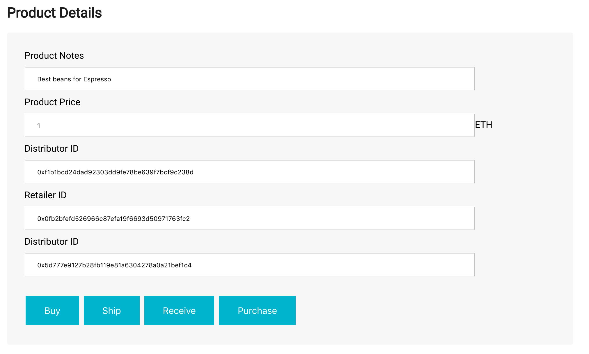
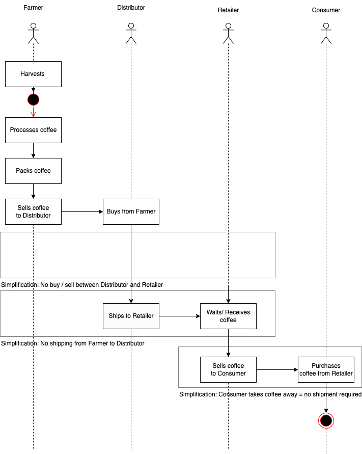
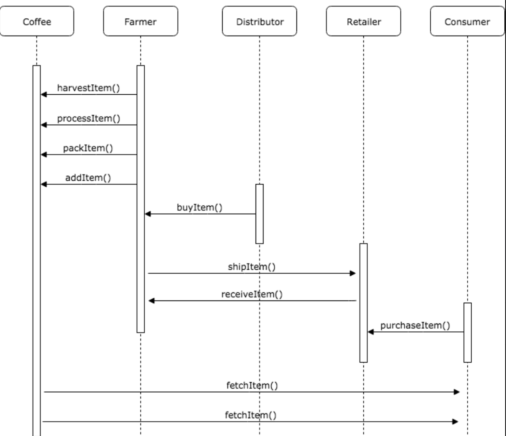
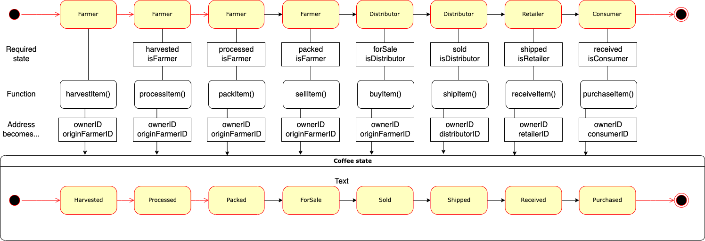
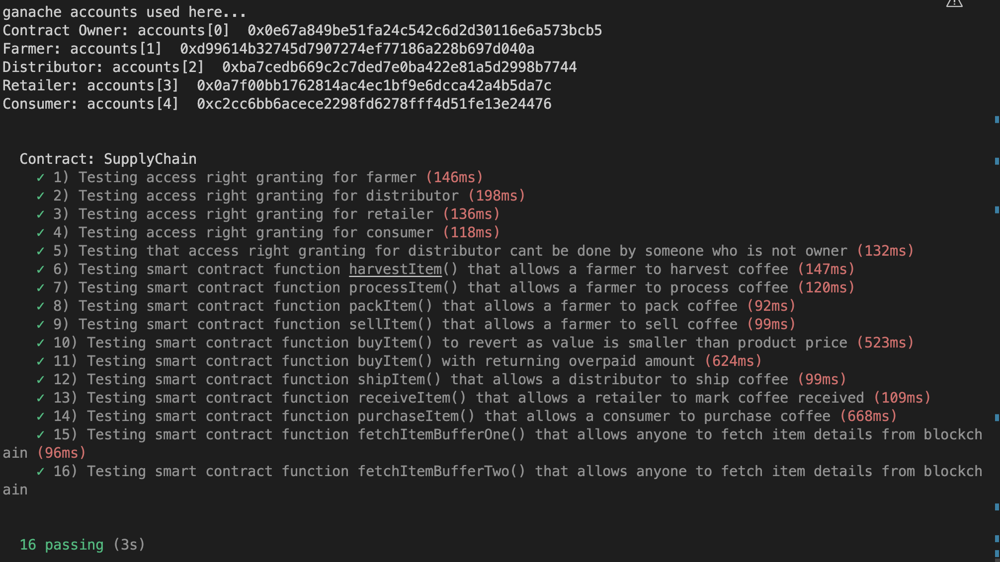
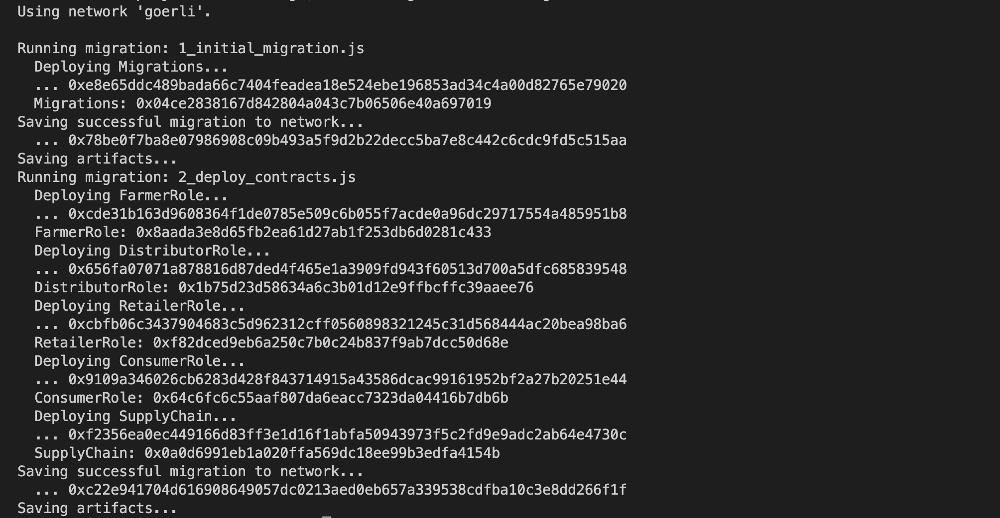

# Supply chain & data auditing

This repository containts an Ethereum DApp that demonstrates a Supply Chain flow between a Seller and Buyer. The user story is similar to any commonly used supply chain process. A Seller can add items to the inventory system stored in the blockchain. A Buyer can purchase such items from the inventory system. Additionally a Seller can mark an item as Shipped, and similarly a Buyer can mark an item as Received.

The DApp User Interface when running looks like...

## Requirement 1 UML
### UML - Activity Diagram

## UML - Sequence Diagram

## UML - State Diagram

## Requirement 2: Libraries / versions
Truffle v4.1.14
Solidity v0.4.24
Node v18.12.1
web3: 0.20.6
hd-wallet: To allow migration to goerli
dotenv: To create safe environment (.env file) for wallet mnemonic and infura keys
tsc: had some trouble and thought I can solve it with setting compiler options

## Test were successful

## Contract deployment to Goerli
https://goerli.etherscan.io/tx/0xc22e941704d616908649057dc0213aed0eb657a339538cdfba10c3e8dd266f1f

